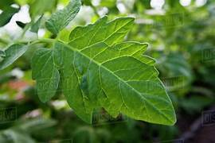
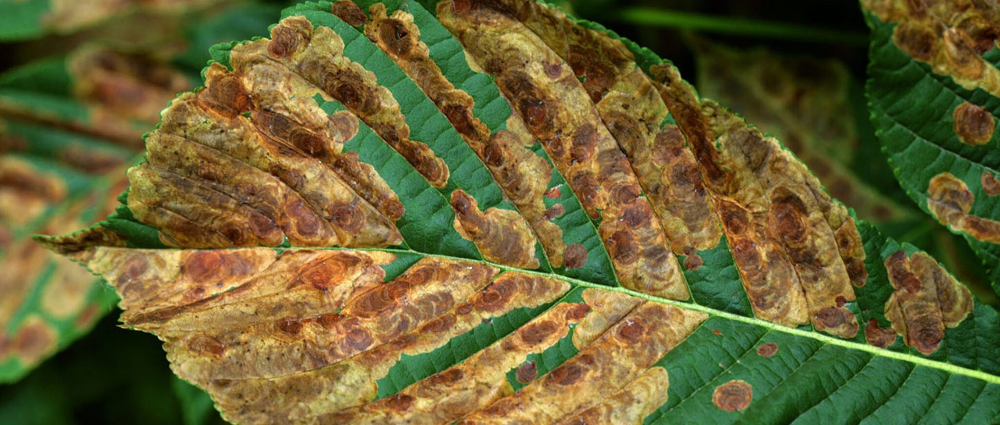

# Plant Health Monitoring System

A computer vision-based tool to detect and analyze the health of plant leaves from images, supporting multiple leaves in one photo.

## Features
- Detects individual leaves using color segmentation (HSV)
- Filters valid leaf regions by shape, size, aspect ratio, and green density
- Estimates disease spots using adaptive thresholding
- Provides per-leaf and overall health assessment
- Works on uploaded images or batches

## Demo




## How to Use

### Option 1: Run the Jupyter Notebook (Recommended for testing)
```bash
jupyter notebook notebook/Plant_Health_monitoring.ipynb